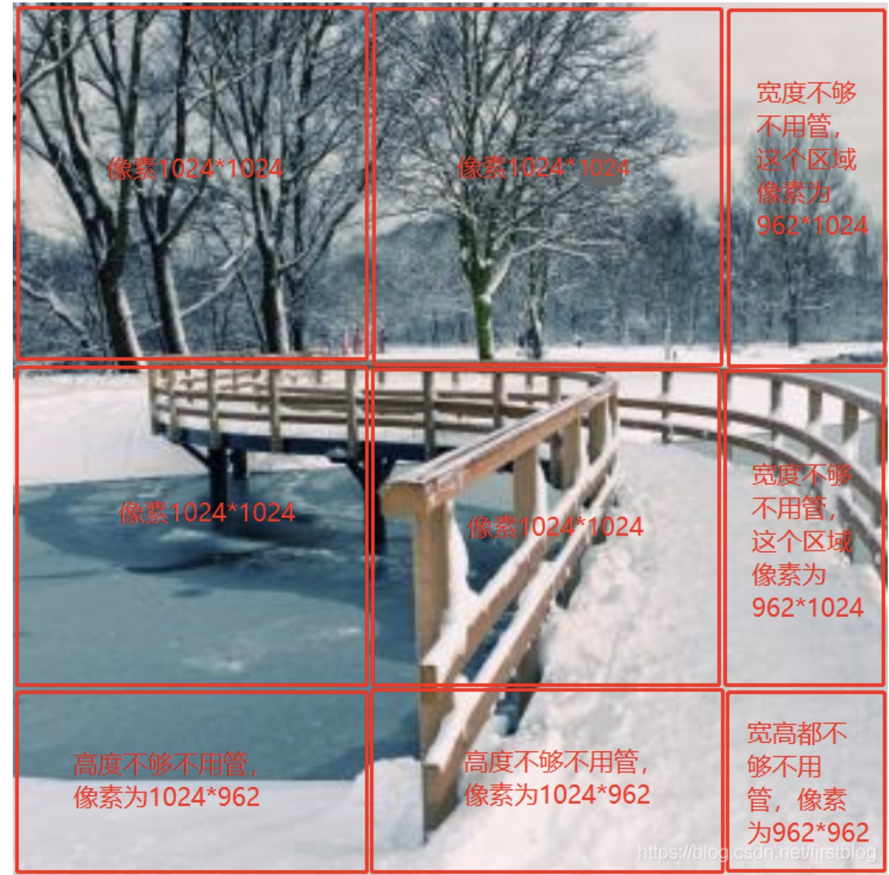
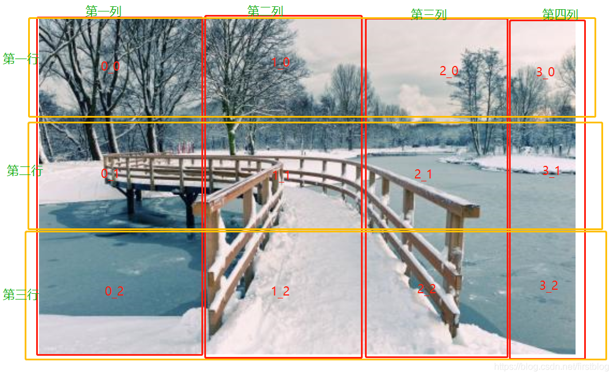
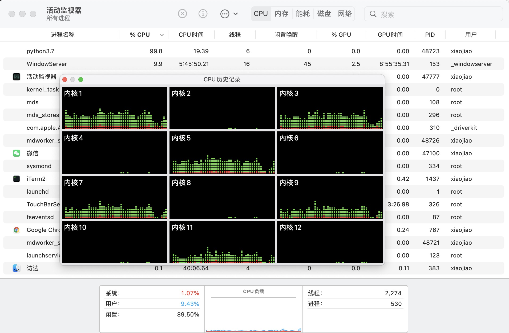
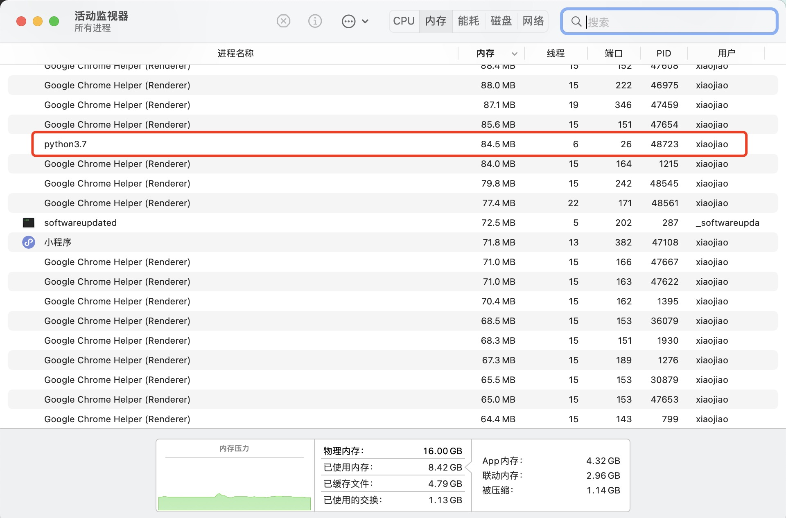
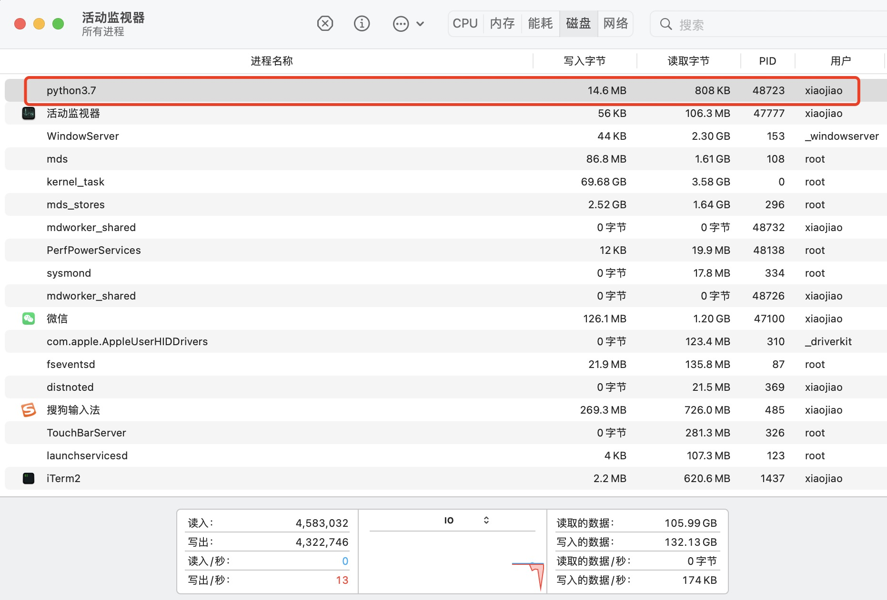
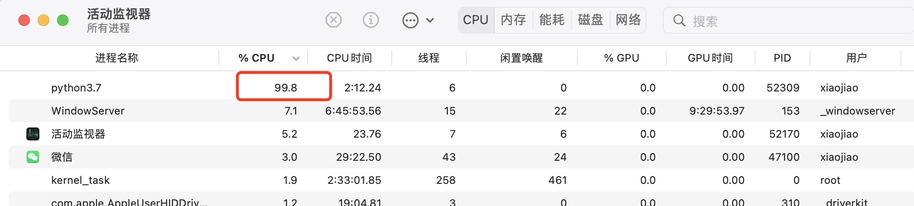
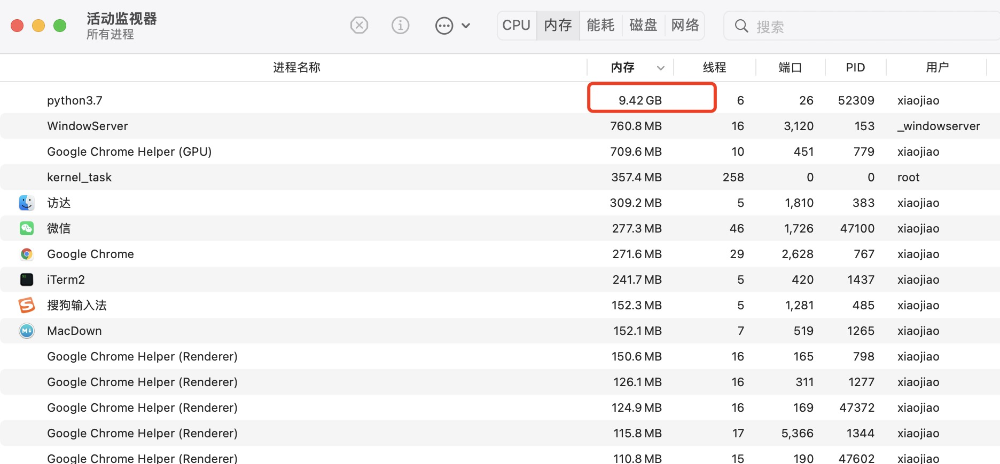
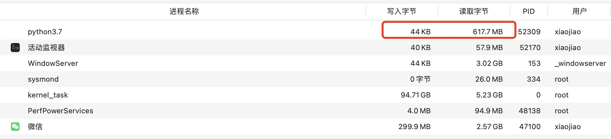

##openslide 安装
[官方地址](https://openslide.org/)   
openslide-python 安装先决条件    

```
Python 3 >= 3.6
```   
macos 安装  

```
brew install opencv
brew install openslide
pip install openslide-python
```  
## openslide图像切割
***官方支持医学病理图片格式***     

- .svs  
	主要应用有医学病理图像
- .tif,tiff    
    Tagged Image File Format。   
    该格式支持256色、24位真彩色、32位色、48位色等多种色彩位，同时支持RGB、CMYK及YCbCr等多种色彩模式。   
    TIFF文件可以是不压缩的，文件较大，也可以是压缩的，支持RAW、RLE、LZW、JPEG、CCITT3组和4组等多种压缩方式。
- .vms   
  Virtual Microscope Specimen  虚拟显微镜标本
- .vmu   
  Uncompressed Virtual Microscope Specimen   未压缩的虚拟显微镜标本
- .ndpi  
  NanoZoomer Digital Pathology Image     纳米缩放数字病理图像
- .scn   
- .mrxs
- .svslide
- .bif 

***其他测试后支持的图片格式***   
   
- jpg
- jpeg
- png
- bmp

### 处理步骤

1.导入openslide，通过传入图像路径imagePath，打开图像，返回OpenSlide对象。  

```
import openslide
slide = openslide.open_slide(imagePath)
```
open_slide函数打开方式，当filename为 whole-slide 图像时（svs、tif等格式），返回OpenSlide对象，当为其他格式图像时（png、jpg等），返回ImageSlide对象  

2.导入DeepZoomGenerator模块，实现从slide对象生成单个 Deep Zoom 切片的功能。   

```
from openslide.deepzoom import DeepZoomGenerator 
zoomslide = openslide.deepzoom.DeepZoomGenerator(osr=slide, tile_size=1024, overlap=0, limit_bounds=False) 

```  

- osr:  openslide打开图像生成的slide对象  
- tile_size:  单个瓦片的宽度和高度，设置切割图像的大小，必须遵守的规则是`tile_size + 2 * overlap`是2的幂次，这样可以获得更好的展示性能。  
- overlap:  添加到图块的每个内部边缘的额外像素数，指图像切割时，是否有overlap个像素重叠。
- limit_bounds:  若为True，表示仅渲染非空区域，表示的是大图整个边缘可能达不到自己设的长和宽。False,则丢弃边缘图。True,保存。   

原始slide图像根据不同分辨率分成多层，并在不同分辨率下切割成多个块。  

3.保存切割的tiles图像和生成dzi文件    

```
#保存tiles图片
def write_tiles(deepzoomslide, format, basename):
    for level in range(deepzoomslide.level_count):
        tiledir = os.path.join(tilePath, "%s_files" % basename, str(level))
        if not os.path.exists(tiledir):
            os.makedirs(tiledir)
        cols, rows = deepzoomslide.level_tiles[level]
        for row in range(rows):
            for col in range(cols):
                tilename = os.path.join(tiledir,'%d_%d.%s' %(col,row,format))
                if not os.path.exists(tilename):
                    tile = deepzoomslide.get_tile(level, (col, row))
                    tile.save(tilename)                                       
write_tiles(zoomslide, format, basename)

#保存dzi文件
def write_dzi(deepzoomslide, format, basename):
    dziPath = tilePath + "%s.dzi" % basename
    with open(dziPath, 'w') as f:
        f.write(deepzoomslide.get_dzi(format))
                
write_dzi(zoomslide, format, basename)                              
                                     
```
4.前端展示   
前端展示需要借用openseadragon  
[openseadragon官方地址](https://openseadragon.github.io/#examples-and-features) 

```
<div id="openseadragon1" style="width: 800px; height: 600px;"></div>
    <script src="./openseadragon-bin-3.0.0/openseadragon.min.js"></script>
    <script type="text/javascript">
        var viewer = OpenSeadragon({
            id: "openseadragon1",//绑定ID
            //openseadragon自带的一些图标
            prefixUrl: "./openseadragon-bin-3.0.0/images/",
            tileSources: {
                Image: {
                    xmlns: "http://schemas.microsoft.com/deepzoom/2009",//默认
                    Url: "./tiles_files/",//分割后tiles图片存放的路径
                    Overlap: "0",//图像分割时指定的参数
                    TileSize: "1024",
                    Format : "jpg",
                    Size:{
                        Height: "21952",//原图维度信息
                        Width:  "30000"
                    }
                }
            }
        });
    </script>
```

### 切割规则  
#### 图像切割规则  
- 1.切割图像之前需要定义切割后每一张图片的大小为多少像素，每张切割出来的图像必须为正方形，且有一个规则，即必须是2的N次方。若图像边缘不够，无需额外操作，举个例子，tile_size指定为1024时：
   
- 2.原图像一定是有多张且像素比不同的图像（即不同层级level_count）（这个可以通过对原图像进行维度缩放实现），以便更加清晰的显示图像。每种像素的图片，都应该按照同样的规则进行切割，即切割大小须一致。   

#### 图像命名规则 
图像切割后，只需要按照一定的规则放置图片，openseadragon会自动去相应目录读取文件。  
每一张切割的图片都需要进行保存，保存的命名格式为`col_row.format`，col和row都是从0开始，format为jpg或png。   
命名规则示例：   
  

相同层级切割的图像放在同一个目录下，不同层级的放在不同的目录，目录的命令规则如下：  
在哪一个层级，目录的命名就是层级序号，从0开始。

这些图像切割后的目录放在一个上级目录下，与dzi文件在同级目录。命名方式与dzi文件的命名有关，例如test.dzi，目录的命名即为test_files。   
以JP2K demo为例：    

```
JP2K
├── tiles.dzi
└── tiles_files
    ├── 0
    ├── 1
    ├── 10
    ├── 11
    ├── 12
    ├── 13
    ├── 14
    ├── 15
    ├── 16
    ├── 2
    ├── 3
    ├── 4
    ├── 5
    ├── 6
    ├── 7
    ├── 8
    └── 9
```
[DZI图像规则官方文档](https://docs.microsoft.com/en-us/previous-versions/windows/silverlight/dotnet-windows-silverlight/cc645077%28v=vs.95%29)   
## 图像处理时的一些指标信息  

- 不同图像大小，指定相同tile_size  

图像名称|原图大小|原图分辨率 | tile_size | 生成层数| tiles总数| 处理时间
---|---|---|---|---|---|---|
The Tower of Babel.jpeg|202.82MB|(30000,21952)|256|16|13583|244s
Summer Evening at Skagen beach.jpg|145.8MB|(16403,11698)|256|16|4039|49s
JP2K-33003-2.svs|275.85MB|((32671, 47076), (8167, 11769), (2041, 2942))|256|17|31417|397s 

处理过程中机器的指标：  

- CPU指标

- 内存指标

- 磁盘指标


tile_size指定为256时，主要的处理瓶颈是CPU
- 相同图像，指定不同tile_size  

图像名称|原图大小|原图分辨率 | tile_size | 生成层数| tiles总数| 处理时间
---|---|---|---|---|---|---|
The Tower of Babel.jpeg|202.82MB|(30000,21952)|256|16|13583|244s
The Tower of Babel.jpeg|202.82MB|(30000,21952)|512|16|3436|188s
The Tower of Babel.jpeg|202.82MB|(30000,21952)|1024|16|900|191s

处理过程中机器的指标：  

- CPU指标

- 内存指标

- 磁盘指标
 

tile_size指定大于256时，处理内存占用迅速增加，占用60%左右，主要的处理瓶颈依然是CPU，但占用内存增大也会影响处理速度。  
